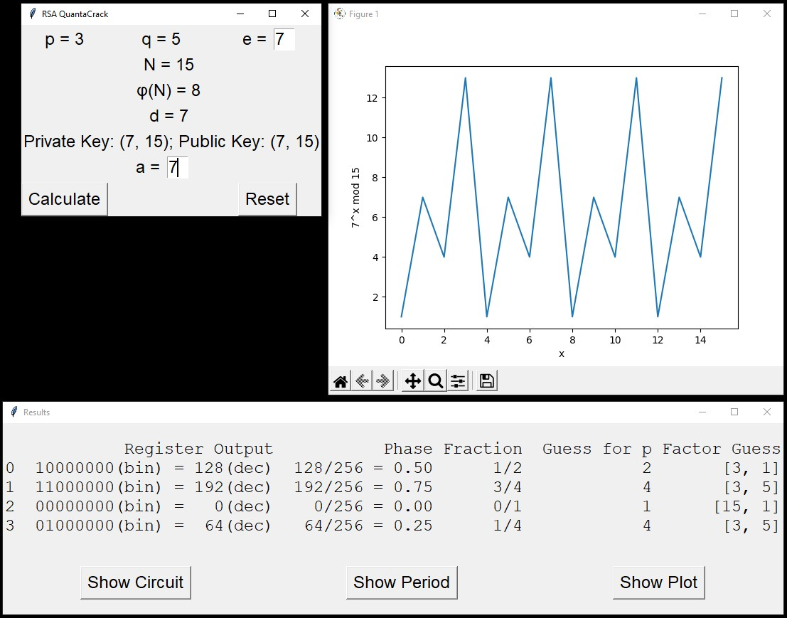

# rsaQuantaCrack
Demonstrator for Shor factorization of 15

This program was create for the lecture QC for MINT (STEM) at TU Dresden. The quantum code itself was copied from https://qiskit.org/textbook/ch-algorithms/shor.html

However, a user experience for demonstration purposes was added as you can see in the following picture.

This application can be converted to an *.exe file using auto-py-to-exe (included in the requirements). When using this compiler, please make sure to add under `Advanced > Other` `--collect-submodules sklearn` and `--collect-data qiskit`.
